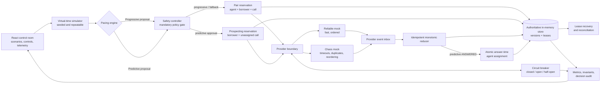

# Architecture

## Scope and trust boundary

This repository is an executable, deterministic model of a SmartDialer control plane. The React control room and the simulation core run in one browser process; there is no real telephony, database, network worker, customer data, or compliance certification. The useful production artifact is the separation of decisions and the state/transaction semantics—not the in-memory deployment topology.

The most important rule is structural: a pacing engine cannot reach a provider. It produces a `PaceProposal`; only a `SafetyDecision` can authorize reservation, and only a committed reservation reaches the provider adapter.

## Progressive and predictive ownership

The two modes intentionally reserve capacity differently.

| Moment | Progressive | Predictive |
| --- | --- | --- |
| Start authorization | Bounded by currently `AVAILABLE` agents | Bounded by an upper-confidence answer forecast, live agents, existing unassigned exposure, borrowers, and provider headroom |
| Before provider dial | Atomically reserve agent + borrower + call | Atomically reserve borrower + call; `agentId` remains empty |
| When borrower answers | The already-reserved agent is moved toward connection | Atomically claim one still-`AVAILABLE` agent using its current version, then bridge |
| If no agent can be claimed | Prevented by the one-to-one start bound, barring agent loss | Count an unserved answer/safety breach; never double-assign an agent |

This design makes the trade-off visible: predictive dialing gains utilization by allowing controlled unassigned setup calls, so its no-abandonment claim is probabilistic. Progressive mode retains the deterministic bound. The safety controller shrinks predictive exposure with an uncertainty margin and can fall back to progressive behavior, but it cannot repeal probability's tail risk.

## Concurrency and transaction boundary

### Prototype

`CallAllocator` methods contain no `await`. JavaScript run-to-completion makes each reservation/assignment a single same-process critical section. Before mutation they re-read state and, when supplied, the observed version.

- Progressive commit: validate `agent.version` + `AVAILABLE` and `borrower.version` + `READY`; then create the call, set agent `RESERVED`, and set borrower `RESERVED` as one synchronous unit.
- Predictive start: validate the borrower version/state, create an unassigned call, and reserve the borrower as one unit.
- Predictive answer: validate that the call is assignable and unassigned, and that the chosen agent version/state is current; then set the agent `RESERVED` and attach it to the call as one unit.

Two simulated workers may read the same version, but only the first commit observes the required state/version. The other receives a conflict. This proves the domain behavior inside one process; it is not a claim that a `Map` coordinates multiple Node.js processes.

### Production PostgreSQL mapping

Use the database as the allocation authority. Cache availability may be a hint, but a cache never wins over the transactional row state.

1. Select eligible work with an indexed query and `FOR UPDATE SKIP LOCKED`, or use a conditional `UPDATE ... WHERE state = ... AND version = ... RETURNING`.
2. Update borrower, agent (when applicable), and call in one short transaction.
3. Enforce uniqueness with database constraints/partial indexes for an agent's active assignment, a borrower's active attempt, provider idempotency key, and provider event ID.
4. Write an outbox command in the same transaction. Commit before calling telecom; an outbox relay then delivers at least once.
5. At predictive answer time, deduplicate the inbox event and claim an available agent in the same transaction. Write the bridge command to the outbox before commit.

No distributed lock or provider request is held inside the database transaction. At-least-once delivery is expected; stable call/event keys and transactional state make repeated work harmless.

## Provider events: duplicates and disorder

`CallEventReducer` folds an unordered stream into monotonic call state:

- `processedEventIds` rejects an exact replay.
- A distinct event that targets the current or an earlier state is recorded as out of order and cannot rewind the call.
- Forward jumps are accepted, so a missing `RINGING` event does not prevent `ANSWERED`.
- The first valid terminal event wins; later events cannot reopen a terminal call.
- Every applied change appends a source, event ID, reason, and time to the transition audit.

In production, store the raw inbox payload even when its state effect is ignored. A unique `(provider, event_id)` row and the call update belong in one transaction. This preserves evidence while separating provider history from internal state truth.

See [state-machines.md](./state-machines.md) for exact transition rules.

## Failure handling

### Worker crash

Calls carry `workerId` and `leaseExpiresAt`. If a worker crashes after provider initiation, the call stays identified by the same internal/provider IDs and scheduled/provider events may continue to arrive. On lease expiry, recovery adopts or reconciles the call and increments recovery telemetry. It does **not** create a second borrower attempt merely because the worker disappeared.

Production recovery should query the provider by the stable idempotency/call key when an initiation outcome is ambiguous. Only a confirmed terminal/absent call may release the borrower for retry. This avoids the classic crash-after-send duplicate dial.

### Provider outage

Provider outcomes and latency feed a rolling circuit breaker.

- Consecutive failures open the circuit; the controller authorizes no new calls.
- Existing accepted calls and late events continue through the reducer.
- Timed-out initiations are treated as ambiguous in production and reconciled before redial.
- After the cool-down, half-open permits a limited probe. Predictive policy falls back to progressive probing while health is degraded.
- Successful probes close the circuit; a failed probe reopens it.

Retries use the original idempotency key, exponential backoff with jitter, and a campaign retry budget. Pacing reacts to provider health rather than creating a retry storm.

### Sudden agent drop

Agent availability is rebuilt into every pacing context. When 40 agents disappear, new approvals shrink on the next decision tick. The allocator's state/version check closes the race between that recomputation and the commit. Already agent-bound calls remain explicit; unassigned predictive calls compete only for agents that are still `AVAILABLE` when an answer arrives. If none exists, the simulator records `unservedAnswers` and `safetyBreaches` instead of corrupting ownership.

Production agents need heartbeat leases. Missing heartbeats move idle agents offline immediately; a reserved/setup call is cancelled or reconciled, while a connected call follows a separately defined transfer/escalation policy. The controller should also have an event-driven stop signal rather than wait only for the next periodic tick.

## Data model

| Record | Important fields | Role |
| --- | --- | --- |
| `Agent` | `state`, `version`, `reservedCallId`, `leaseExpiresAt`, `stateSince` | Capacity token and agent lifecycle |
| `Borrower` | `state`, `version`, `priority`, `attempts`, `reservedCallId` | Prevents concurrent/duplicate borrower attempts |
| `DialerCall` | optional `agentId`, `borrowerId`, state/version, worker lease, provider IDs, processed event IDs, transition audit | Aggregate that joins allocation, provider, and recovery state |
| `ProviderEvent` | event ID, call/provider IDs, type, occurred/received time | Idempotent external input |
| `PaceProposal` | requested calls, formula, factors | Advisory and explainable model output |
| `SafetyDecision` | action, requested/approved count, hard capacity, upper answer bound, reason/invariant | Auditable authorization record |
| `ProviderStatus` | health, rolling success/latency, circuit state, failures | Routing and safety input |
| `WorkerSnapshot` | active/crashed state, recovery time, owned calls | Demonstrates leased ownership |

The prototype stores `Set`s and object references in `Map`s and clones them for snapshots. Production tables should use immutable event/inbox/outbox rows plus versioned current-state aggregates.

## Observability

The control room exposes:

- proposal factors, request/approval counts, reason code, and active invariant;
- agent, borrower, and call-state distributions;
- provider health, latency, success rate, circuit state, and in-flight volume;
- allocation conflicts, duplicate/out-of-order/terminal events, leases recovered, worker crashes, unserved answers, and safety breaches;
- utilization, answer/completion rate, call rate, queue depth, and a bounded decision timeline.

Production should export the same dimensions as metrics and structured logs, correlated by campaign/call/decision ID, with OpenTelemetry traces across outbox delivery and webhooks. Page immediately on any safety breach, unserved answer, duplicate active assignment, prolonged open circuit, lease backlog, or webhook-age SLO violation. Keep borrower identifiers out of metric labels and redact/encrypt PII in logs.

## Scaling: 100 -> 1,000 -> 10,000 agents

| Scale | Likely behavior / first pressure | Change |
| --- | --- | --- |
| 100 | One scheduler and indexed transactional store are sufficient; provider latency dominates. | Keep one campaign leader/lease, batch small decisions, measure rather than distribute early. |
| 1,000 | Full collection scans and a single allocation critical section create contention; snapshots/event fan-out get expensive. | PostgreSQL eligibility indexes, `SKIP LOCKED`, queue-backed workers, incremental aggregates, bounded UI sampling. |
| 10,000 | A global agent pool/hot campaign row and provider rate limits dominate; webhook ingestion and telemetry cardinality surge. | Partition by campaign/tenant/skill and provider route, shard ordered work by call ID, maintain per-partition capacity tokens, apply provider quotas/backpressure, stream aggregated telemetry. |

The **first bottleneck in this prototype** is the O(agents + borrowers + calls) scan/clone performed around each decision and snapshot, followed by browser rendering—not CPU time in the pacing formula. The first production correctness bottleneck is the shared allocation index/transaction: more workers contending for the same available-agent pool cause conflicts and latency before they add throughput. Fix the data access pattern and partition ownership; “add more servers” alone makes that contention worse.

At every stage, preserve one global property locally: a partition may authorize only against capacity it owns. Moving to queues or shards must not introduce two authorities for the same agent.
