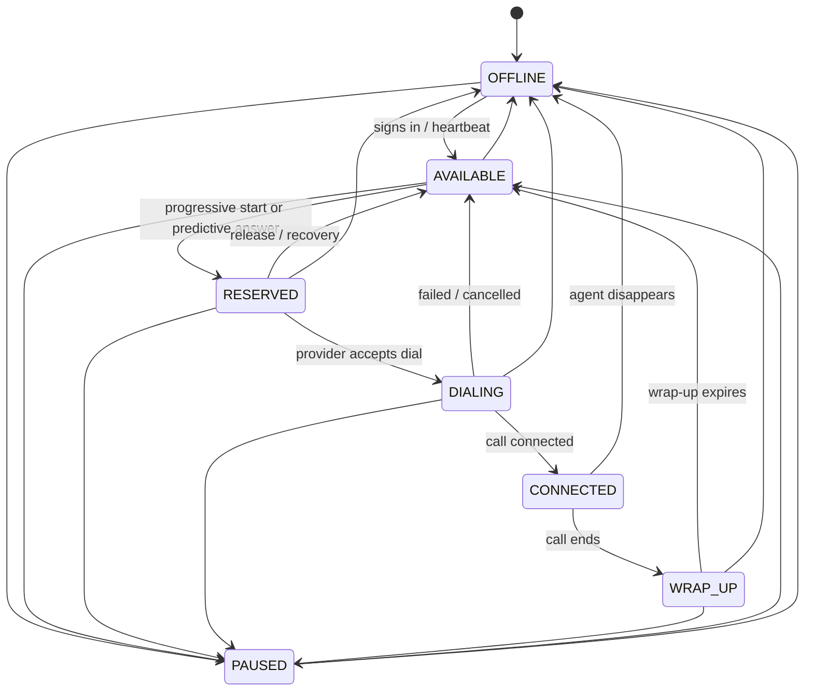

# State machines

The state machines are the correctness boundary between noisy external events and the dialer's internal truth. The implementation lives in [`src/core/state-machines.ts`](../src/core/state-machines.ts); the diagrams below describe that code, not an aspirational production flow.

## Agent lifecycle

Rules:

- An agent can back only one active call. Progressive allocation changes `AVAILABLE -> RESERVED` before the provider request; predictive mode intentionally leaves the call unassigned during setup and performs the same atomic change when the borrower answers.
- A transition to the current state is an idempotent no-op. Any other edge not shown above is rejected with an error.
- Every applied transition increments the agent's `version` and resets `stateSince`. Reservation code compares the observed versions before committing, so two workers cannot both win against the same in-memory record.
- `leaseExpiresAt` makes `RESERVED` and setup work recoverable. A recovery pass releases or reconciles stale ownership rather than leaving the agent unavailable forever.
- `CONNECTED` intentionally cannot move directly to `AVAILABLE`: the agent passes through `WRAP_UP` unless the agent has gone `OFFLINE`.

## Call lifecycle

```mermaid
stateDiagram-v2
    [*] --> QUEUED
    QUEUED --> RESERVED: borrower + agent reserved
    RESERVED --> INITIATED: provider accepts
    INITIATED --> RINGING: provider event
    RINGING --> ANSWERED: provider event
    ANSWERED --> CONNECTED: agent is assigned; bridge succeeds
    CONNECTED --> COMPLETED: conversation ends

    QUEUED --> FAILED
    RESERVED --> FAILED
    INITIATED --> FAILED
    RINGING --> FAILED
    ANSWERED --> FAILED
    CONNECTED --> FAILED

    QUEUED --> CANCELLED
    RESERVED --> CANCELLED
    INITIATED --> CANCELLED
    RINGING --> CANCELLED
    ANSWERED --> CANCELLED
    CONNECTED --> CANCELLED

    COMPLETED --> [*]
    FAILED --> [*]
    CANCELLED --> [*]
```

The diagram shows the normal path and side exits. In predictive mode, `agentId` may be empty through `ANSWERED`; the orchestrator must win an `AVAILABLE` agent compare-and-set before advancing to `CONNECTED`. The reducer deliberately accepts a **forward jump** (for example `INITIATED -> ANSWERED`) because a webhook may be delayed or missing. It never permits a backward move. A terminal event may terminate any non-terminal call; all three terminal states are absorbing.

## Provider-event reduction

For each event, `CallEventReducer` applies the following rules in order:

1. If `event.id` is already in `processedEventIds`, return `DUPLICATE` and do nothing.
2. Record the new event ID, then map its provider type to a call state.
3. If the call is already terminal, return `TERMINAL_IGNORED`.
4. If the target is the current state or has a lower order, return `OUT_OF_ORDER`.
5. Otherwise, append exactly one transition and increment the call version.

This makes each call a monotonic fold over an at-least-once, unordered event stream:

| Input sequence | Result |
| --- | --- |
| `ANSWERED(id-1)`, `ANSWERED(id-1)`, `COMPLETED(id-2)` | First answer and completion apply; the replay is `DUPLICATE`. |
| `ANSWERED(id-1)`, `ANSWERED(id-2)` | First applies; the distinct but redundant second event is `OUT_OF_ORDER`. |
| `COMPLETED`, `ANSWERED`, `RINGING` | `COMPLETED` becomes final; later events are `TERMINAL_IGNORED`. |
| `RINGING`, then a late `INITIATED` | The call remains `RINGING`; the late event is `OUT_OF_ORDER`. |

The provider's `occurredAt` is retained in the transition audit without allowing time to move backwards. The applied timestamp is bounded by the current state's timestamp and event receipt time. In production, processed provider-event IDs and the call update must be persisted in the **same database transaction** under a unique `(provider, event_id)` constraint.

## Ownership after terminal transitions

The state reducer decides only whether a call transition is valid. The simulator/orchestrator performs the related ownership changes: answer-time agent assignment in predictive mode, agent wrap-up after a connected completion, borrower completion, and safe release/reconciliation after failure or cancellation. Keeping validation pure makes duplicate delivery harmless and lets recovery repeat reconciliation.
